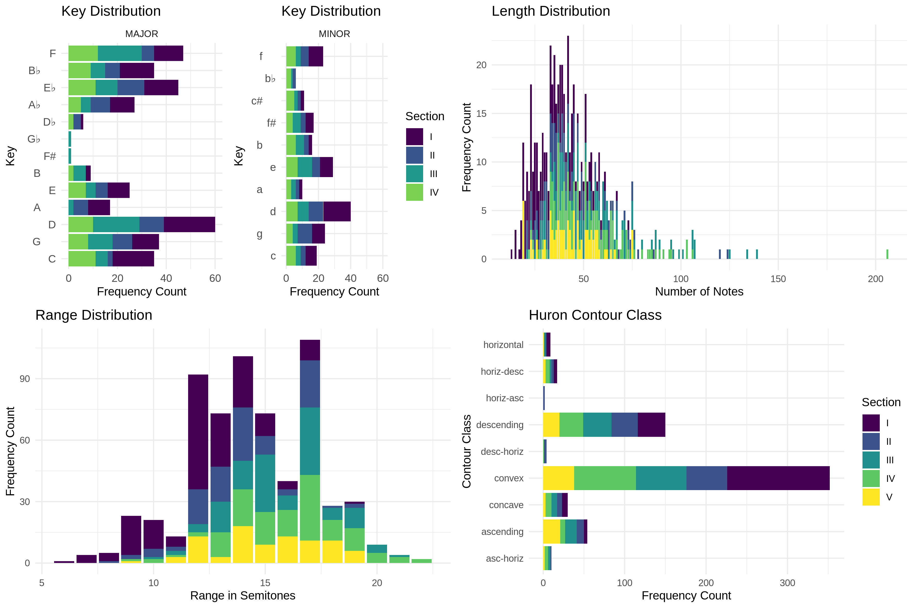
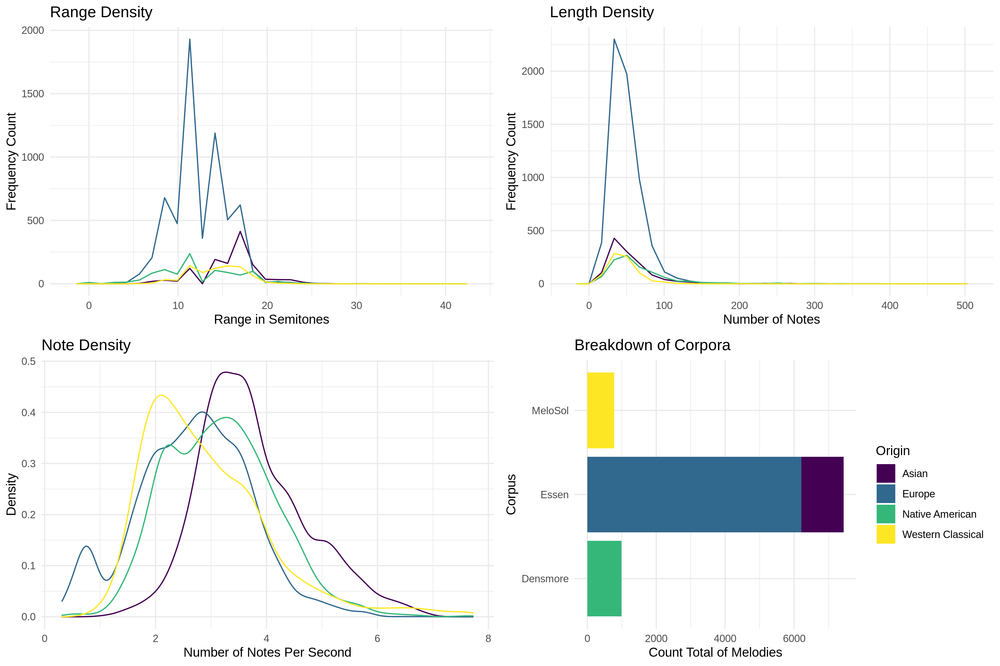
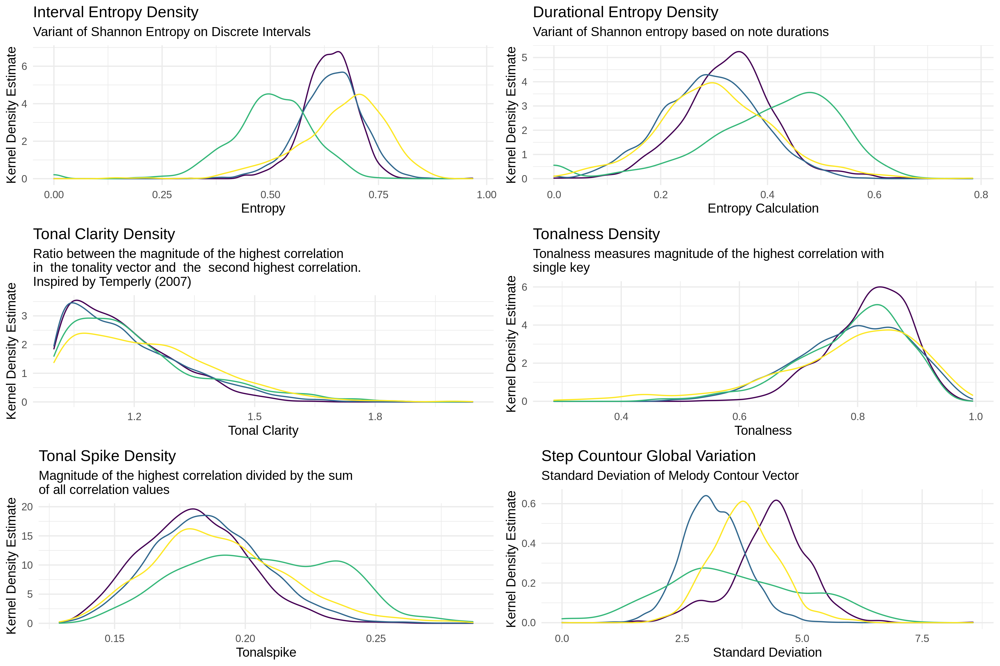
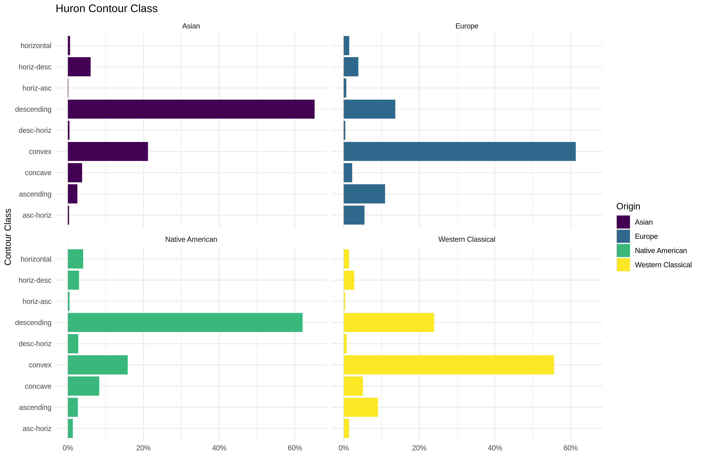
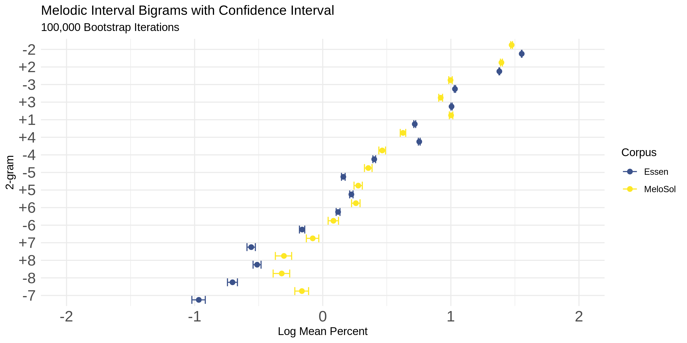
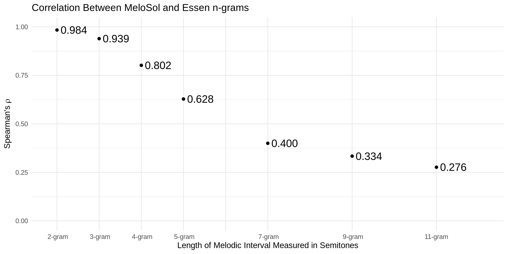

Earlier this month I learned some of the research from my dissertation was accepted for publication!
Publications are always reason to celebrate, but this one is especially deserving because of the amount of work that went into this project.
I love sharing what I have been up to so of course I am going to write a post about it for those that are interested.

You can find the [pre-print here](https://psyarxiv.com/cmwr6).

## Need 4 Data

Let me begin by making a gross generalization: the harder data is to get, the more useful it is going to be.

Of course that's not a hard and fast rule, but it is easy to imagine a one dimensional continuum with large randomized clinical trials on one end and taking a tally of your friend's opinion on the outcome of the next presidential election on the other.
Aspects of randomization and large sample sizes in experimental designs that are set up to answer a specific question regarding the efficacy of some treatment will, in theory, but much more reliable than the convenience, collider conditioned sample of something notoriously as difficult to predict as an election.
Most data probably exists somewhere between these extremes. 

I would bet that many fields of research have their own version of this continuum and I know my area of expertise in computational musicology is no different.
Yes, we have a lot of data sets out there that you can use, but the thing is that if you study something as big and amorphous as "music", you're rarely going to be able to find what you want in terms of a usable data set if you have a very specific question you want to answer.

There are [tons of great music datasets](http://www.ismir.net/resources/datasets/) from the [music information retrevial](https://musicinformationretrieval.com/) world, but many of these data sets tend to deal with audio data (like the waveform playing music to your headphones) rather than something that looks like sheet music.

There's tons of cool stuff that can be done with  audio data (recommendation systems, the Shazam algorithm, dynamic time warping), but it's very difficult to work with "the notes" (as a music theorist) with this kind of data.
You need a digitized version of the score to be able to do this.

There are a lot of ways to do get your data into one of the many helpful formats like [MIDI](https://en.wikipedia.org/wiki/MIDI), [MEI](https://music-encoding.org/), and [kern](http://kern.ccarh.org/), each with their own advantages and disadvantages, but the problem is just getting a paper score into these formats.

More often than not, especially with MEI and kern, you need to have this data entered manually.
Someone, somewhere needs to sit down and plop in each note into an application like [MuseScore](https://musescore.org/en). 

This process is unbelievably boring.
It's so boring that one of the [software toolboxes for manipulating kern](https://www.humdrum.org/index.html) files is literally called [humdrum](https://www.google.com/search?q=define+humdrum&oq=define+humdrum&aqs=chrome..69i57j0l7.2757j1j4&sourceid=chrome&ie=UTF-8).

So if you want to ask a new musical question, you pretty much have two choices.

You can head over to something like [kern scores](http://kern.ccarh.org/) and see what is there, with odds being that you're not going to find exactly what you need OR you can make a new dataset.
Seeing that grad school is all about contributing something new and helpful to the research community at large, I saw it as a worthwhile investment in myself and my community to do the latter. 

Specifically, what I am interested in is how people learn^[Not about to split hairs on the definition of learning here] melodies (both explicitly and implicitly).
For my Ph.D., I wanted a dataset that I could use that had melodies that are used when people learn melodies.

There of course was no ready-to-go dataset called "Learnable Melodies" and the closet thing to this was this giant dataset that has been around since the mid 1990s (a dataset older than many undergrads right now) that has thousands of folk song melodies called the [Essen Folk Song Collection](http://kern.ccarh.org/browse?l=essen) which has over 6,000 monophonic (meaning a single line) melodies.
It's kind of close to what I wanted, but not exactly.

In being interested in how people learn melodies also comes with this idea in the music and science literature that sort of assumes that if you have this big database of all these melodic patterns, you can use these patterns to help find meaningful correlates to human responses to music.

This was an idea got a lot of attention first from this great book by Leonard Meyer called [Emotion and Meaning in Music](https://books.google.co.uk/books/about/Emotion_and_Meaning_in_Music.html?id=HuWCVGKhwy0C) that linked the musical structure to how people hear music, but as of recently if you really want to dig into this area the canonical citation is David Huron's [Sweet Anticipation](https://books.google.co.uk/books?hl=en&lr=&id=sgr-DwAAQBAJ&oi=fnd&pg=PR5&dq=david+huron+sweet+anticipation&ots=0b1Cy0UQSZ&sig=YP6ndavb5wcjKogsdZ8SOQb04Lw#v=onepage&q=david%20huron%20sweet%20anticipation&f=false).

In this book, Huron does some really neat stuff following up on Meyer's ideas and this book continues to be the gateway drug to computational musicology for many people. 

I remember being really inspired reading this book before and during grad school and then getting even more into these ideas reading about some of the [computational models of auditory cognition](https://pubmed.ncbi.nlm.nih.gov/29749625/) via the work of Marcus Pearce's IDyOM model and the [multiple viewpoints](https://www.tandfonline.com/doi/abs/10.1080/09298219508570672) paper that inspired this work.

Both the work of Huron and Pearce have used corpora like the Essen collection extensively and it acts as the training data for many of these statistical models of music cognition.
To relate this work to things in popular culture, the [Google Doodle](https://www.google.com/doodles/celebrating-johann-sebastian-bach) that [I wrote about a while ago](https://davidjohnbaker.rbind.io/post/digital-representations/) was trained using similar data that the multiple viewpoints paper was trained on.

So I figured if I wanted to be a part of this conversation at the academic table, I should start by contributing something that might be helpful.

So as a psychological fail safe, during my Ph.D. I digitized 783 melodies from a sight-singing book.^[For the uninitiated, sight-singing is a skill most undergraduates majoring in music need to learn that allows you to look at a piece of music and know how it sounds without playing it on an instrument.]

This meant entering over 36,000 notes by hand into MuseScore over the however many months I was writing my dissertation. 
It was not fun, but I am glad that I did it because now there's a new dataset on the block called the _MeloSol_ corpus!
I ended up calling it the _MeloSol_ corpus since it's _Mel_ odic data and the name of the first author of the book is someone named _Sol_. 
A very appropriate name for an author of an aural skills book.

## So What?

So now that it's been digitized, what can you do with it?

Well if you're part of this very niche world of computational musicology, you can just read the [pre-print](https://psyarxiv.com/cmwr6), but if this is your first time even realizing computational musicology is a thing^[Hello LinkedIn reader who thought they were about to read about data science] let me take you through a walk through of what's here using the data visualizations I made as a guide.

Let's start with the first two figures (panels of four images each).

> FIGURE 1

{width=100%}

> FIGURE 2 

{width=100%}

These first two images are pretty much what an exploratory data analysis (EDA) look like if you're a computational musicologist.
They go beyond the fact that the data is 783 melodies made up of 49,730 analyzable tokens (basically notes and rests) and starts to look at sub-groups of interest.
From the figures we can see that there happen to be more melodies in major rather than minor, what keys you can expect to find, and how long (measured in number of notes) the melodies are.

We can also see from the bottom right corner of Figure 2 that my little corpus of 783 melodies is about 1/10th the size of the _Essen_ I was talking about before.
This is important to point out because one thing I am interested in as a researcher is how big your dataset actually has to be before you can start getting anything helpful out of it.
In Figure 3 I also ran the FANTASTIC toolbox over all the corpora to show the distribution of these abstracted features.

> FIGURE 3

{width=100%}

The fourth figure plots another aspect that might not be of immediate interest to non-music-psychology readers which is the contour or shape of a melody.

> FIGURE 4

{width=100%}

Contour is not really something most people think or talk about when it comes to picking vocabulary to describe why they like certain melodies (unless you're working your way through [Dr. Jacob Gran's counterpoint vidoes](https://www.youtube.com/watch?v=VlvUmS5GUxg)), but contour plays a very big role in the melody literature.

I won't get into that here, but through this Figure I just wanted to show the high level similarity between my little _MeloSol_ corpus and some of the other corpora that are also single line melodies.
We have the _Essen_ collection (split between geographic region since there is an Asian subset of it) as well as some _Densmore_ melodies. 

Up until this point, these are pretty much summary features of a melody answering questions you can measure either directly (what is the range, length) or indirectly (tonalness via a toolbox that approximates a measurement for it), but really what I would like as an end goal with this corpus is to have people start using the _MeloSol_ in tandem with the _Essen_ in exploring these claims I mentioned above about our latent understanding being mapped to corpora, so I went a bit deeper in comparing the _MeloSol_ and the _Essen_.

We dive into that comparison in the next two figures.

## Comparing Corpora 

This gets a little more complicated, but not beyond the grasp of most people who have found this post.
Figure 5 was an attempt to start to answer the question how similar these two corpora are.

> FIGURE 5

{width=100%}

It's kind of a difficult question because you need to come up with a way to operationalize similarity^[woof], but it's an important question because when working with music data it is MUCH harder to get more data if you want it.

Setting aside the annoying process of encoding it, most of our historical musical data comes from a finite population (borrowing the actual statistics definition here).
Unlike trying to find the "true" average number of times a cat meows the longer you go without remembering to feed them-- a task you can accomplish by just running lots of experiments on lots of cats in many conditions-- you can't really get more Bach or Davis if you had lots of hypotheses you want to test.^[I will take an aside here to point out how ridiculous this is to even assert that something like a p value would be meaningful in this context given the finite sample...]

So instead of getting multiple datasets to keep testing ideas (like how the frequentists think about probability in the long run with many samples trying to model P(D|H)),  we could try to Bayes it out (P(H|D)), but another approach that is a bit more brute force is this thing called bootstrapping your sample.

There's a great video here on it [here](https://www.youtube.com/watch?v=655X9eZGxls), but the TLDR is that you just pretend that the data that is in front of you is the theoretical population you never really get to know the "true" values of and just take lots of combinations of data to see how stable the relationships are in your dataset.

This is basically what I wanted to do with these two corpora.

The analysis in Figure 5 does this on the musical intervals that are present in the corpora.
For those without a music reading background, a musical interval is the distance between two notes.
So if you think of the first two notes of "Here comes the bride!", instead of describing this as one being played ("Here") then jumping up and repeating three times ("comes the bride!), we just call that musical moment by the distance jumped.

If you think of a melody as just a bunch of intervals, and then these strings of intervals (melodies) as belonging to a bigger collection (the corpus) we can then have two big pools of data to compare to one another.
One is a big pool of all the intervals that come from the _MeloSol_ corpus and the other the _Essen_.
The idea being that if you just grabbed random collections from each pool, could you know what pool you were pulling out of if you all you had to look at was the intervals you were seeing?

If you couldn't tell, you'd probably assume the corpora were very similar, but if it was kind of obvious, you'd consider them to be different.
And don't just do this a few times, but like 100,000 times.
How often to certain intervals emerge from your sample?

So what Figure 5 shows you is basically that thought experiment run on both of the corpora.
The little dots from each color representing each corpora appear very close to one another suggesting that the intervals are drawn from our big pool with similar proportions, suggesting superficial similarities between the two. 

Now some more "musically" minded people might be like, yeah, no duh they are similar since they come from Western music (remember, that's the point I am trying to make) but surely this task would be easier if you got to pull out strings that were longer than just one interval.

That's what Figure 6 tries to quantify.

> FIGURE 6

{width=100%}

This figure shows what happens when you try to count up all the unique strings of various length and compare how similar they are using a rank order correlation.
As you might expect, when you have shorter strings, the two pools are very closely related (having a correlation coefficient near 1), and the more unique intervals you plop on, the more dissimilar they get. 

Now this is quite a rough way to talk about similarity on the large level, and if this interests you but not like on this coarse level, there's more of an applied theoretical link to this in the latest MTO with [Brian Miller talking about this](https://mtosmt.org/issues/mto.20.26.3/mto.20.26.3.miller.html) with Leonard Meyer's theory of style.

This whole analysis is all to just hopefully show that there is a new corpus on the block with similar properties to the one we all have been using that is smaller and a bit more manageable and probably actually is closer to what we mean when we talk about the expectations of Western tonal music than all these European folk songs. 

So will people use it?
Who knows, but I know I have.
I've used it with great success for a new project that will get its own post when it comes out.

If you have questions about this or computational musicology in general, please get in touch! 
