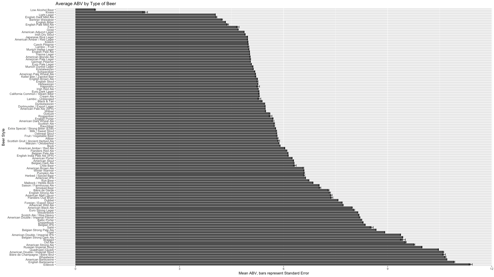

## Background

I read [Medium](https://medium.com/) blog posts on "How to Become a Data Scientist" more often than I care to admit.
Much of this comes from a fear that after doing all this work on the PhD and then hitting the Music Theory job market, I won't fit the mold of the kind of theorist most schools want to hire. 
Not coming from [one of five schools that seem to have a monopoly on the tenure track jobs](https://pushpullfork.com/music-theory-job-market/) can be a bit discouraging, but I also won't deny that having a non-academic job with a regular 9-5 schedule and a [decent salary](https://www.glassdoor.com/Salaries/data-scientist-salary-SRCH_KO0,14.htm) is pretty tempting after spending the vast majority of my twenties in school.
And even if I don't go on over to industry after the PhD, I'll probably always be looking for a bit more work in summer.

On top of all of that, I believe that skills that are acquired in a PhD (especially if you do computational musicology and music cognition!) are very transferable to most jobs, and it's just a matter of being a bit more pro-active in promoting myself that might help me one day land a stable, non-academic job.

That said, one tweet I saw last week by [Jesse Meagan](https://twitter.com/kierisi) linked to this really interesting Linked-In 
post by [Tanya Cashorali](https://twitter.com/tanyacash21) that purported to have a [one size fits all data-science interview process](https://www.linkedin.com/pulse/how-hire-test-data-skills-one-size-fits-all-interview-tanya-cashorali/) which has candidates take home a big dataset with a bunch of beer reviews and answer four very broad questions.
Considering myself an aficionado of How-To-Become-a-Data Scientist articles, this of course caught my eye.

After reading the article, I figured why not give it a go?
It's the start of the semester, I'm basically ABD, need more of a portfolio beyond [my github](www.github.com/davidjohnbaker1), and I have nothing to do with my Saturday morning. 
Why not see what I can produce in 4 or 5 hours?
At the very least I'll hopefully just have something to point to if a future employer wants to see how I think through data-science problems.

And if anyone is reading this that does have comments on my code or thought process... please let me know what you think on [Twitter](www.twitter.com/DavidJohnBaker)!
I'd love some feedback!

## Exploring the Dataset
 
The first thing I did was to grab this dataset which you can get [here](https://s3.amazonaws.com/demo-datasets/beer_reviews.tar.gz?lipi=urn%3Ali%3Apage%3Ad_flagship3_pulse_read%3BDqDjqRycTlq5seB4xN3ocA%3D%3D) and then I set up my R script with a few of my favorite packages (again, big love to Ben at [GormAnalysis](https://gormanalysis.com/) for helping me learn [data.table](https://cran.r-project.org/web/packages/data.table/vignettes/datatable-intro.html)).

```{r}
#=====================================================================================#
# Beer Script
#=====================================================================================#
# Library
library(ggplot2)
library(data.table)
library(stringr)
#=====================================================================================#
beer <- fread("data/beer_reviews.csv")
#=====================================================================================#

```

The dataset has about 1.5 million observations across 14 different observations, so don't try to open it in LibreOffice.
The reviews come from a variety of different users that have rated the beers based on five different attributes (Appearance, Palate, Aroma, Taste, Overall) and then each beer has a few other variables listed such as its ABV, the brewery it comes from, the beer's name (duh), and what kind of beer it is.

```{r}
names(beer)

beer[, .(Number = unique(beer$brewery_name))]
beer[, .(Number = unique(beer$review_profilename))]
beer[, .(Number = unique(beer$beer_name))]
beer[, .(Number = unique(beer$beer_style))]
```


From a bird's eye view we have 56,857 unique beers in 104 different categories from 5,743 different breweries and 33,388 unique beer aficionados who have gone out of their way to tell this website what they think about the beers they drink.

Before diving in further, it's worth doing a preliminary check of the quality of the data (aka we should know if this is BAD (Best Available Data) or has undergone a fair deal of cleaning).
As someone who comes from more of a psychology background, I've noticed what certain people consider "clean" when it comes to data varies a lot.

The first thing I check for is if there is any kind of data missing and if there is, is it due to chance? 
Or is it due to some sort of systematic variation?

```{r}
table(complete.cases(beer))
67785/1518829
```

So about 4% of our rows don't have every entry, so probably not too much cause for concern unless we start getting into specific questions about specific beers.
Looking into this a bit further it seems like it's just beers missing the ABV of the beer.
Anyone who has made some beer ratings has made ratings on all five variables.
And although it's only 4% of our entire ratings that don't have their ABV, comparing that to every beer we have, we see we are actually missing ~25% of the ABV ratings of all of our beers.
That could be a problem later, but it's good to know about it sooner rather than later.

```{r}
beer.complete <- beer[complete.cases(beer)]

beer[!complete.cases(beer)][, .(.N = unique(beer_name))]
14110/56857

beer[969]
```

More problems might come up here or there, but let's move on the first question.

## Which brewery produces the strongest beers by ABV%?

Answering the first question on the list is pretty straight forward.
Essentially all you need to do is grab all of the observations that have an ABV associated with their rating, and then
get the average ABV of all the beers that that brewery produces.

```{r}
# Use object before that has only ratings with ABVs 
beer.complete[, .(AvgABV = mean(beer_abv)), by = brewery_name]

# Create table that has means and standard deviations of beers by brewery 
# Order them from most to least
abv.counter <- beer.complete[, .(AvgABV = mean(beer_abv), 
                                 SdABV = sd(beer_abv)) , 
                             by = brewery_name][order(-AvgABV)]
abv.counter
```

Having this table could be good enough for government work, but looking at the output there are clearly problems, and one thing to consider in this table (and pretty much this whole dataset) is "Is this data point a good representation of what I am trying to measure?". 
Note for example the huge variability as measured by the standard deviation in our top answer as well as the fact that some of the SDs have NAs and there is a value of 0.
Given that, I think it'd be good to put on some sort of threshold that would up the quality of our answers.
One way to do this would be to see exactly how many beers each brewery makes and use that as a proxy for how big the brewery is.
 
The code below does just that and reveals the variability in terms of size of breweries within this dataset.

```{r}
# Create table that counts number of beers 
NoOfBeers <- beer.complete[, .(NameOfBeer = unique(beer_name)), 
                           by = brewery_name][, .(.N), by = brewery_name]
NoOfBeers

# Make table that lists each beer with it's ABV and the name of the brewery
abv.table <- NoOfBeers[abv.counter, on = "brewery_name"]
abv.table

# Create z scores 
abv.table[, zAvgABV := scale(AvgABV)]

```

After visually inspecting the graph on the size of breweries (below), I figured I could just look at breweries that make over five beers (which hopefully wipes out your hipster friend's "micro brewery" in his basement where he is just trying to make the most potent IPA ever) and then only look at beers that score 4 standard deviations above the mean of all beers in terms of ABV content to narrow down possible candidates.

```{r}
# How many beers to count for a big brewery? 
hist(NoOfBeers$N, breaks= 200, 
     main = "Distribution of Size of Breweries", 
     xlab = "Number of Beers Produced by a Brewery")

NoOfBeers[N > 200] # Clearly some big breweries here! 

abv.table[N >= 5, ][order(-AvgABV)]

hist(abv.table[N >= 5, ][order(-AvgABV)]$zAvgABV,
     xlab = "z Score of ABV", 
     main = "Distribution of ABV in Breweries that make more than 5 Beers")

abv.table[N >= 5 & zAvgABV > 4, ][order(-AvgABV)]

```

Doing it this way puts Schorschbräu as the highest ABV brewery, which makes sense because [they claim to make the world's strongest beer](https://www.beeradvocate.com/beer/profile/6513/51466/?ba=wordemupg).
Making a quick plot of the data for our winner and the second place finisher, we see how strong Schorschbräu really is. 

```{r}
schor.abv <- beer.complete[brewery_name == "Schorschbräu", 
                           .(beer_name = unique(beer_name)), by = beer_abv]

ggplot(schor.abv, aes(x = beer_name, y = beer_abv)) + 
  geom_bar(stat = "identity")  + 
  labs( title = "Schorschbräu Beer ABV", x = "Beer Name", y = "ABV") +
   theme(axis.text.x=element_text(angle = -90, hjust = 0)) 

brassOrg.abv <- beer.complete[brewery_name == "Brasserie Grain d' Orge (Brasserie Jeanne d'Arc SA)", 
                              .(beer_name = unique(beer_name)), by = beer_abv]

ggplot(brassOrg.abv, aes(x = beer_name, y = beer_abv)) + 
  geom_bar(stat = "identity")  + 
  labs( title = "Brasserie Grain d' Orge Beer ABV", 
        x = "Beer Name", 
        y = "ABV") +
   theme(axis.text.x=element_text(angle = -90, hjust = 0)) + ylim(0, 60) 
```

I think that saying Schorschbräu is technically correct here, but after sharing my findings with my one beer drinking friend
he pointed out that one thing that this analysis did not take into account was that beers
that are traditionally brewed to have a higher ABV (like IPAs and Belgiums) might skew my results.
So if you are a big IPA brewery, you are going to have higher average ABV because of the beers you decide to brew!

So in the true spirit of that [data science Venn diagram](http://drewconway.com/zia/2013/3/26/the-data-science-venn-diagram) noting that data scientists need to be flexible in 
incorporating others' domain knowledge, I did another analysis to just show how much an answer can change depending on how you change your operationalization of the question! 

Let's do another one!

First up for this one is making a plot of the data to see how much beers actually vary from type to type. 

```{r}
# Get mean and SD of each beer type 
abv.by.type <- beer.complete[ , .(MeanAbvType = mean(beer_abv), 
                                  SdAbvType = sd(beer_abv)), 
                              by = beer_style]

# For Graphing, order, set style as factor 
ordered.abv.by.type <- abv.by.type[order(-MeanAbvType)]
ordered.abv.by.type$beer_style <- factor(ordered.abv.by.type$beer_style, levels = ordered.abv.by.type$beer_style)

# Code for plot, blogdown crunches the images 
# Average ABV by beer type
# ggplot(ordered.abv.by.type, aes(x = beer_style, y = MeanAbvType)) + 
#  geom_bar(stat="identity") +   coord_flip() +
#  labs(title = "Average ABV by Type of Beer",
#       x = "Beer Style",
#       y = "Mean ABV, bars represent SD") +
#  geom_errorbar(aes(ymin=MeanAbvType-SdAbvType, ymax=MeanAbvType+SdAbvType)) +
#  theme_bw()
```

{width=50%}

So you can see here that if you wanted to have a higher ABV on average for your brewery, you'd benefit from having more IPAs, Barley Wines, and Belgian Stouts.

Now with average ABV for each beer, let's then match that to our big list, find how each beer fairs against its own category, sort them, and then combine them with our information from before on how big the brewery is. 
For the purposes of this example, let's only look at breweries that have over 100 beers in the database and look the top 20.

```{r}
# Combine ABV per type data with complete data
beer.complete.avg.abv <- abv.by.type[beer.complete, on = "beer_style"]
# Make new z score variable based on other beers in group
beer.complete.avg.abv[, zABV := (beer_abv-MeanAbvType)/SdAbvType]  
# Get averages per brewery on z variable
zAvgBeers <- beer.complete.avg.abv[, .(AvgAbvZ = mean(zABV)), by = brewery_name][order(-AvgAbvZ)]
# Combine back with our data on proxy of size of brewery
BreweryAndAvgAbv <- zAvgBeers[NoOfBeers, on = "brewery_name"]
# And the winner is...
BreweryAndAvgAbv[N > 100][order(-AvgAbvZ)][1:25]
```

Looking at this list, we get a totally different answer.
It appears that on average [Kuhnhenn Brewing Company](https://www.beeradvocate.com/beer/profile/2097/) brews their beers 1.26 standard deviations above the mean of all other beers in that category!

Both answers could be technically correct, but more importantly demonstrate how important it is to come up with how you frame your question first, and then try to answer it so you don't end up going on a fishing expedition! 

Moving on to question #2! 
