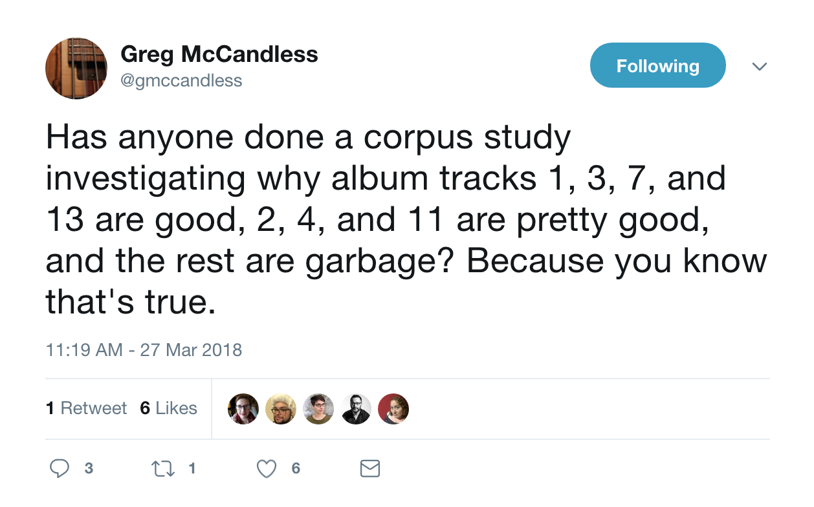

## Twitter Theorizing

The past two months have been pretty busy between defending my general exams, presenting some thoughts we have been having at [MCCL](www.musiccog.lsu.edu) about how to quantify musicianship at [Danny Jenkins](https://twitter.com/pubmusictheory)' Public Music Discourse conference, and showing off some work [Jacob](https://twitter.com/grannygoat) and I have been working on dealing with the [analysis of Rock music](www.davidjohnbaker.rbind.io).
I haven't had much time to think about what to blog next about (no one wants to read about the red tape of getting my thesis approved) and I have yet to come up with a question worth trading in time that could be spent writing things that matter.
Of course, Twitter came through when I saw a tweet by [Greg McCandless](https://twitter.com/gmccandless) armchair theorizing (the best kind of theorizing IMO) that there is some sort of relationship between track order on an album and the quality of a song.



This seemed like a very music\~data~science question that wouldn't be too hard to start to pick at.
I've have been looking for an excuse to learn more about [RCharlie](https://twitter.com/_RCharlie)'s [spotifyR](https://github.com/charlie86/spotifyr) package and this seemed like a good way to procrastinate work, but not waste time (the key to being productive as a PhD student!)

Going into this question I didn't really have any _a priori_ hypotheses other than I wanted to check out ahead of time is if the rank order of a song changed with the advent of streaming technologies in the early 2000s.
My only idea would be that if you had a CD, tape, or record, you'd want to put the good stuff up right away. 
Especially if you had tapes, no one is about to look for their good songs.

It's also worth mentioning that looking into a question like this, it's good to keep in mind which was the causality is going.
Do artists pick their best tracks and put them in privileged positions on their albums?
Or does placing a track in one position lend itself to becoming more popular?

## The Data

Only going from the twitter conversation from above, this is a pretty murky question and picking what data to best get at the question will probably have some bearing on the answer (as it should and always does!).

So knowing I kind of wanted some sort of Representative sample and had that question about the effect of decade and streaming services, my first thought was to grab a bunch of albums that were associated with the 'big hits' of each of the decades.

First thing needed to do this was to grab the libraries I like to work with and line up my Spotify ID with the spotifyR account. 

```{r}
#library(ggplot2)
library(data.table)
library(stringr)
library(spotifyr)

# SERVER THINGS HERE
Sys.setenv(SPOTIFY_CLIENT_ID = 'bf9ae528bb5e44379f8fc0bd1891aba3')
Sys.setenv(SPOTIFY_CLIENT_SECRET = 'd9035b7dc36a45b8b3d49b5ce096681a')

access_token <- get_spotify_access_token()
```

Now I kind of had to get creative here with finding out how to get a representative enough sample to answer the question, but not so much as that I'm going to be breaking a sweat over it.

The idea that I had was to find some playlists of equal track lenght that focused on songs of the 40s, 50s, 60s, 70s, 80s, 90s, 00s, and today.
What I wanted to do was grab all the information from these decade inspired playlists, use the albums that make them up as our representive sample, then use those albums as the corpus of albums to look into. 
I started to do this and found quickly that a lot of the tracks that these playlists are based off of are actually taken from compilation albums.
This was a bit annoying because I'd guess that we'd be loosing that original effect if we used these.
That said, I tried to be cognizent of that so that the data that I was using best represented the question that I wanted to get at.

### Getting Playlists 

So after cruising a bit through Spotify, I found couple of playlists that seemed satifying enough.
To double check that I did this....

The other idea that I had when doing this was to use Temperley and de Clerqu's RS200 as a list of artists that semi-represent artists from any decade. 
If I took all the albums associated with those artists, it seems like that might be a good thing to do.

So I went over to the RS200 website and ended up getting the listing of tracks and artists.
On a side note here, on THIS GOOGLE DOCUMENT, I have a list of the RS200 where I am trying to add some meta data to it to answer a question that my colleague and I have about some rock music.
So instead of asking people to pay or have ads on a site, if you are bored, can feel free to add to it and put your name next to it if you want to help out.

Ok, shameless ask out of the way.
Getting back to the task at hand, we now have a listing of all of the artists in the list.
Let's import the data here and make it clear with the intent of making a table of all of the unique artists from the dataset.

```{r}
rs200meta <- fread("tmpdata/RS200.tsv")
setnames(rs200meta, 
         c("V1","V2","V3","V4","V5","V6"),
         c("song","No","Album","Artist","Released","Overlap"))
Artists <- rs200meta[, .(unique(Artist))]
setnames(Artists,"V1","Name")
# Compress String To Match How spotifyR likes its text
Artists$NoSpace <- str_replace_all(Artists$Name,"\ ","")
Artists$Compressed <- str_to_lower(Artists$NoSpace) 
```

From here we have 122 unique artists whose discography we can now scrape.
First step up is to write a loop (something I am very bad at and learned a lot of stuff from doing this) to make an object with all of our artists. 
We can do this with the ```getartists()``` function
Mention I am an idiot, no loop.


```{r}
## Loop to get all of the artists (30 Seconds)
corpusArtists <- lapply(artistList, get_artists)
```

From here the next step is to get all of the albums associated with those artists.
We do this with the ```getalbums``` function.

```{r}

```

Now that we have all the albums here we need some sort of dependent variable that is going to serve as a proxy for how good a track is.
While the ISMIR community is pretty far off writing a function that tells you how good a song is, we might operationalize 'good' as being songs that are popular (I can hear my more skeptical friends booing).
If you have a better idea, please let me know.

Sooo let's now use the ```get_track_popularity``` function in order to get the data we need.

```{r}
# Popularity code
```


Now we have a ton of data here, let's made it as streamline as possible and make sure to have some sort of grouping variable for decade.

```{r}

```

Before running our analysis, it would be a good idea to swap out any sort of albums that are either too short or too long. 
If we are then relying on Greg's tweet from before, albums need to have at least 13 tracks to be considered.
To give ourselves a bit of wiggle room, let's look at albums between 10 and 15 tracks long.
We can first look at album rank, then after that take a more abstract approach to think about privileged positions using a density function.


```{r}
# Code to control for album length 
```

Lastly, since if what we are truly after is an effect of album order and dependent variable is popularity in terms of plays (count data), we need to standardize the amount of plays per album.
This way we know per album, which are the popular tracks.
I also thought about doing this with a rank order approach, but the thing with z scores is that it will preserve that the magnitude of the effects that we are dealing with.
I'd also note we can always drop down a level of granularity into the world of rank-order, non-parametric statistics, but we loose the ratio portion of things.

If you're not familiar with the concept of z scores, check it out.
It's one of my favorite ideas in statistics.

```{r}
# Group by z score for
```

OK, we now have a representative corpus, blocked in decade, have excluded compilation albums, as well as really short and long albums, and have standardized plays relative to the album with the intent of looking effects of album placement

OK, first step up is to just take a bird's eye view and look across all albums in our corpus.
Remember now that our IV is averaged across albums with various track lengths.

```{r}
# DENSITY PLOTS HERE
```

EXPLORE