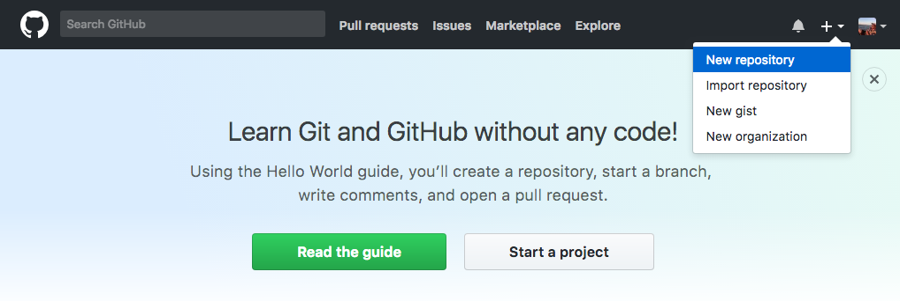
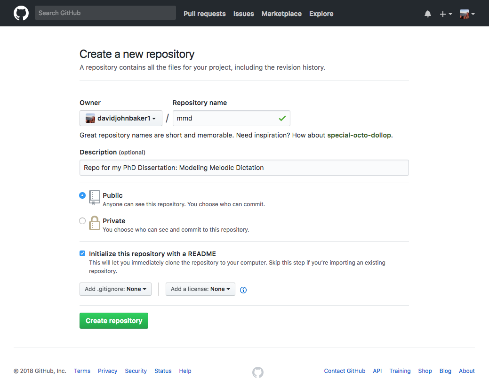
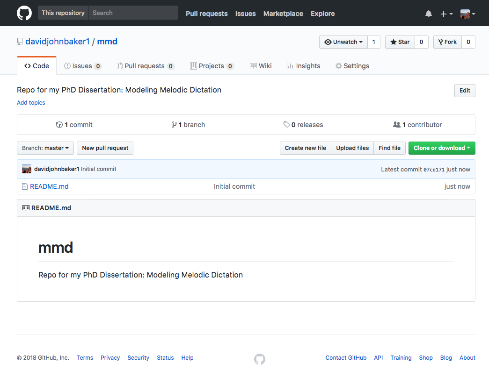
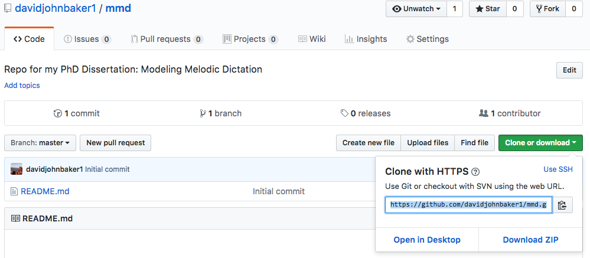
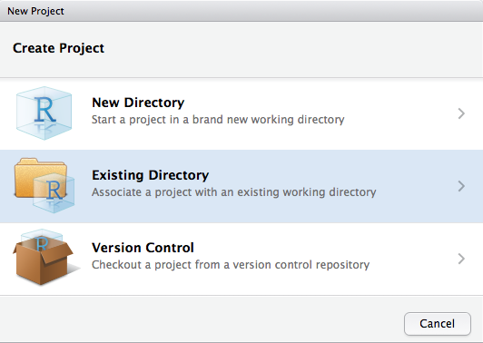
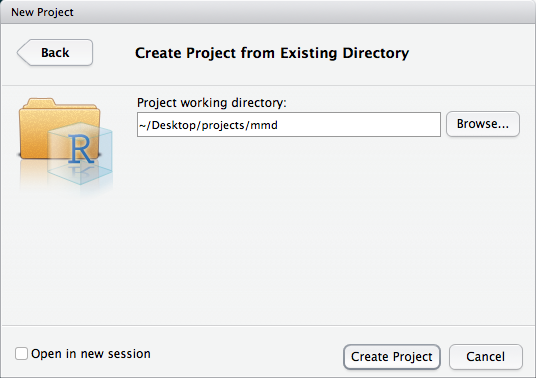
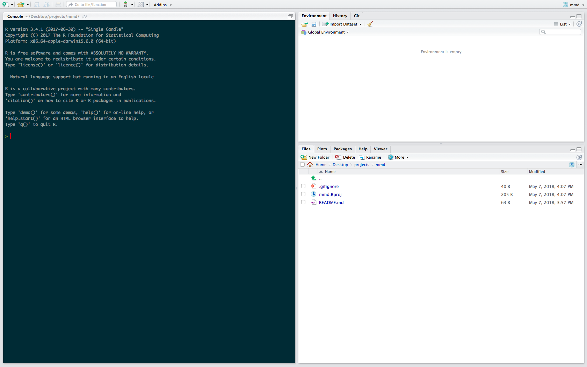
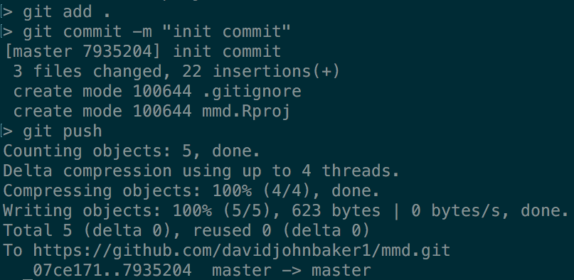

## Staying Organized

The semester is finally over meaning it's time to put some serious dents into my research projects.
I've got a couple floating around at this point, but the one that I need to think about the most is my PhD dissertation.
From what I've heard it's quite an intensive ordeal and given that over the next year I need to write a multi-chapter document with a dissertation committee spread across thousands of miles, I think it might be important to try to **stay organized**.

A couple of different people I follow on Twitter have suggested that I use [Scrivner](https://www.literatureandlatte.com/scrivener/overview) to keep track of writing and what not, but for the past year or two I have really been trying to push myself to commit to exclusively using [Free and Open Source Software](https://en.wikipedia.org/wiki/Free_and_open-source_software) for everything I do.
For some time now I have been thinking about trying to write my entire dissertation using all things [R](https://cran.r-project.org/) and [RStudio](https://www.rstudio.com/) and I think I'm ready to commit to that.
I don't want to get on a rant here about FOSS and how great R is, but let me just give a few reasons why I want to head down this path as opposed to using prepackaged, paid software.

1. It's free
2. Learning the ins and outs of the software is going to make me a better programmer/researcher over the course of the next year (more skills = more employment options!)
3. Working with this will help make my work more accessible and reproducible

That said, I'm not only going to try to write my thesis using only free software (I'm sure there will be exceptions), but one thing I also want to do is to document as much of the process as I can so that anyone else (especially those without computer backgrounds!) can do the same if they would ever want to learn these sets of tools.

So where do you even start?

## R Projects and Git(hub)

When starting a new project, the first thing that I normally do is to create a place on my computer where the entirity of that project can live and then link that up to [github](www.github.com) so I can share what I do with the people I work with.

In this post I will just walk through how to just set up a version controlled project with R via Github.

### Step One: Create a repository on Github

Not being the greatest at computers, I find it's easiest when starting a project to start on github first, then copy that onto your computer.

The first thing to do is to log into your github account (assuming you have one, it's easy to sign up!) and create a new repository (repo) using the little plus at the top right of your home page.



From here you want to give your repo a name, a small description, and tick the box that asks you initialize it with a README file.
Check out the screen shot below.



I usually like picking something easy to type as you can see from above.

Once you click 'Create Repository', it will take you to your repo's home page and should look something like this 



From here you are going to want to click the green 'Clone or download button' and then copy that link to your clipboard.



With the link copied, you then want to open up your terminal (if you're a Windows user, make sure to get [Gitbash](https://git-scm.com/)!!) and then navigate to where you want your project to live.
I keep all my projects in a directory called ```projects`` on my desktop for easy access.
From here, you then want to use git to clone your project.
If you don't have git you can get it [here](https://www.linode.com/docs/development/version-control/how-to-install-git-mac/), and if you don't have homebrew, you can get that [here](https://brew.sh/).

```git clone yourproject.git```

Now if you look in your projects folder (or just press ```ls``` as in ```l```i```s```t all the files that are in your directory), you'll notice you have a new directory sent directly from github heaven!

Since I'm going to primarily using R to manage this project, I turn this directory into an R project so that every time I open this project, it can be governed with R.

In order to do that, I need to get out of terminal, and then open up RStudio.
From here you need to go to File > New Project > Create From Existing Directory > Then navigate and select to open the folder you just cloned from github. 
If you then tick the box that says to open the box in a new project, you'll then see something like this:








Tah dah! 
We've now made our directory and R project and can save our changes on github. 

Now all that's left to do is sync up the changes on our local machien with that on github.
We can bring terminal back and assuming that we are in our project's directory (we can check that by typing ```pwd``` in Terminal), we then need to enter the work life cycle of updating a github account with the following commands 

```
git add .
git commit -m "added R project (or whatever you did)"
git push 
```

If we then go back to our github, we can see that our changes should have been updated!

I should note that each time you start your project you want to ```git pull`` to make sure that you have the most updated version of the project (for when you are eventually collaborating with other people).

In writing this I actually realized there is SO MUCH that underlies this seemily basic process of starting a project, so if anyone has any questions on this whole process, please let me know. 
