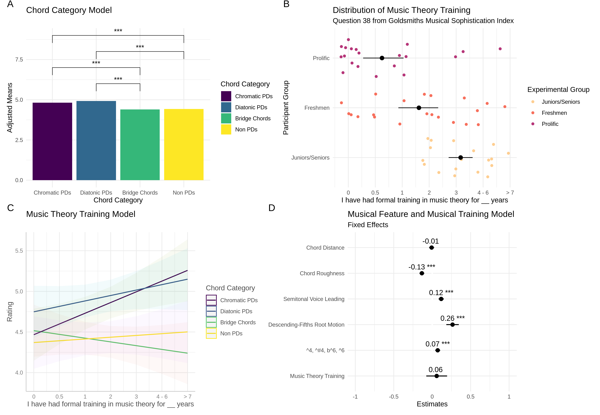
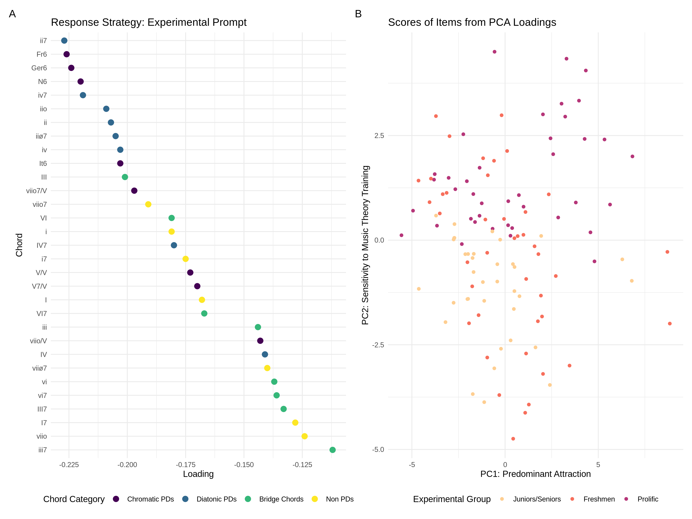
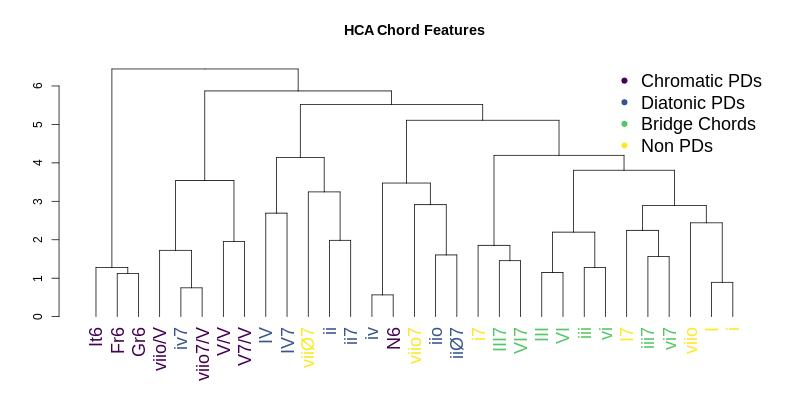

Earlier this year a collaboration paper I worked on was accepted at _Music Perception_.
The paper models data from an experiment with a relatively straight-forward design investigating pre-dominant chords.

The way it works was as follows:

You hear four chords.

The first is a tonic chord, the second is some target chord, then you hear a V chord, then a I chord.
You as the responder need to rate on a sliding scale how much you think the target chord is attracted to the next chord.
The target chord could have been one out of maybe 30 different chords, all from various "types" of chords. 

Our goal was to try to figure out if what we think of as "pre-dominant" chords really are attracted to dominant chords (what they pre) more so than other chords.
And if we could do that, start to build some new ideas around ideas regarding pre-dominant chords. 

Now if you're a theorist, you know there is baggage to deal with here.
What do we mean by pre-dominant? 
What makes something pre-dominant? 
Who gets to decide what is pre-dominant and what is not.
The paper has a very in-depth literature review on this that if you're interested.

But if you just skip over the _what even is a pre-dominant chord_ questions and use "the literature" as a starting point, we can start to ask some basic questions (the paper's guiding hypotheses).

They were:

1. Are pre-dominant chords more attracted to dominant chords than other chords?
2. Does music training influence this?
3. Do the features of the chords (their internal characteristics) predict attraction at all? 

I won't re-write the argument here, but we tried to capture the main story of these findings in one of our figure panels shown below:

{width=50%}

The long story short is yes, pre-dominant chords do get rated as more attracted if we group them how the literature tells us to.
We basically had a textbook example of a planned contrast that was evident even after multiple corrections. 

Further, musical training also seems to interact with this relationship with more trained individuals rating chords we'd think of as pre-dominant as more attracted compared to others.
Though the effects were small, things all appeared to go in the direction and magnitude that we'd expect.
While not super surprising, seeing as there's not much attention given to looking at pre-dominant relationships, this is a good sanity check. 

The bottom right panel also shows a feature based regression model. 
In the future I want to think out loud more about this kind of approach, because the more I thought about it, the more curious I got. 
But I'll just leave this for now. 

While this was all well and good and what we expect, we also did some fun fancy stats on the data we did have that in my opinion sparked an interesting conversation.
Check out this figure here.

{width=100%}

So what you're looking at in the left panel is a PCA of all of the data from the experiment to the prompt "How attracted is Sound 2 to Sound 3?".
Now what I think is cool about this is that this is a use of PCA that is not like you see in all these "what weird clusters are in this data" data science tutorials.

Instead, because we just have a singular prompt and one question, all items _should_ load onto the first component reflecting the degree they reflect the prompt.
Sort of like a one-dimensional model of musical training or intelligence, but the latent trait here is _attraction to the dominant_.
So it's a very fancy way of getting at what is the most pre-dominant-y of all the chords (based on our assumptions!). 

Now what you might say is that you could have just did that by averaging all the reponses.
Yes, sort of.
What is slick about this approach is that unlike doing a brutish averagin, we can continue to explore the structure of the rating data by looking at subsequent components of the model.

So as expected, our first component is a sort of data-driven or empirical listing of how attractive to dominant-y each chord in our design was to the dominant.
What tops the list? 
Things like ii7.
Nice.
What bottoms the list? 
Chords that we wouldn't think to be pre-dominant at all.
We also see a general grouping pattern from above as shown from the colors.

Now to the slick part.
If we then take the scores that we get from the PCA and pump them back through the participant ratings (thank you tidymodels), we can plot each response based on the degree it loaded on each item.
Using the second component (look at the right panel now), if we then group by participant group, we can actually see a complete divide between our online participants and music students in the second component.

Why is this interesting?
Well in theory, just using this data alone, you could tell what subject pool someone came out of based on a single, weird, very subjective question.
I think that's interesting. 

So out of the PCA we got both an empirical way of pre-dominatness (if you buy the swap) and evidence that music training is playing a role here.

Now this of course raises a lot of questions about definitions, participant strategies, and possibile circularities in how we think about what it means for a musical sound to be called something, in this case pre-dominant.
We of course attend to these in our discussion a bit (also because of a similar exploration we did using a reviwer's suggestion of HCA).

{width=100%}

But what I found particualry interesting about this whole thing is that I feel it's a great example of how you can have some sort of idea about what TRUE categories you theorize to exist.

In this case, the idea of creating observational langauge to call something a pre-dominant.
And then you can go out in the world, collect some data -- not to say this is or is not a thing ( _p_ <. _whatever_ ) -- but looking at what people do lets you think new thoughts about it.

Like is this a good category to consider?
To what degree are our definitions dependent on the metaphorical langauge we use to describe a relationship we feel to exist? 
Does formalizing this into something empirical help us question some of our assumptions in ways we wouldn't have to if you just can say "trust me, im a theorist"?

If you do give the paper a read, myself and my two new wonderful collaborators would love to hear about it.
Please get in touch if you do.

The pre-print to the paper is [here]().
Also here is the [github]() and [OSF]() if you want to see the code and data. 